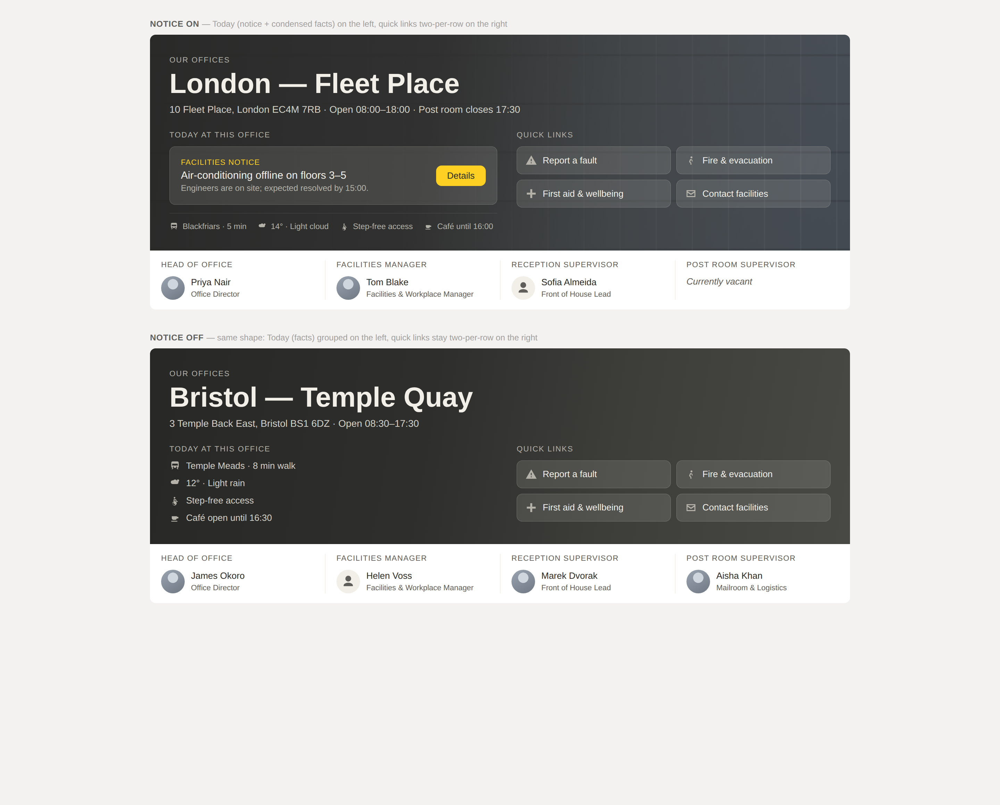

# Office Hero — SharePoint Framework web part

A full-bleed hero banner for individual **office information pages** on a
corporate intranet. It renders an office photograph behind a charcoal scrim, the
office name and details, an optional facilities notice, everyday "office facts",
a quick-links grid sourced from a SharePoint list, and a key-contacts banner.



> The screenshot is illustrative. The web part adapts to its container width (see
> [Responsive behaviour](#responsive-behaviour)).

---

## Contents

- [At a glance](#at-a-glance)
- [Prerequisites](#prerequisites)
- [Getting started (local)](#getting-started-local)
- [Build & deploy to the app catalog](#build--deploy-to-the-app-catalog)
- [Provision the quick-links list](#provision-the-quick-links-list)
- [Property reference](#property-reference)
- [Office facts & weather](#office-facts--weather)
- [Key contacts & profile photos](#key-contacts--profile-photos)
- [Responsive behaviour](#responsive-behaviour)
- [Accessibility & contrast](#accessibility--contrast)
- [Colour rule (gold)](#colour-rule-gold)
- [Out of scope / follow-ups](#out-of-scope--follow-ups)

---

## At a glance

| | |
|---|---|
| SPFx version | **1.23.2** |
| Framework | React 17.0.1 + TypeScript 5.3 |
| UI | SCSS modules (no CSS-in-JS, no Tailwind); `@fluentui/react` v8 icons |
| Data | PnPjs v3 (`@pnp/sp` 3.26.0) wired to the SPFx context |
| Property controls | `@pnp/spfx-property-controls` 3.24.0 (file picker, people picker, collection data) |
| Full bleed | `supportsFullBleed: true` |

---

## Prerequisites

- **Node.js `>=22.14.0 <23.0.0`** (Node 22 LTS). SPFx 1.23.2 pins this range in
  `package.json` `engines`; newer/older majors are unsupported. Verified on
  Node 22.22.2.
- **npm** 10+ (ships with Node 22).
- **gulp-cli** installed globally: `npm install --global gulp-cli`.
- Access to a SharePoint Online tenant **app catalog** to deploy the package.
- For the quick-links list: **PnP.PowerShell** (`Install-Module PnP.PowerShell`)
  or the PnP provisioning engine.

Install project dependencies:

```bash
npm install
```

---

## Getting started (local)

SPFx no longer ships the offline local workbench, so previewing uses the
**hosted workbench** on your tenant.

1. In `config/serve.json`, replace `{tenantDomain}` with your tenant, e.g.
   `contoso.sharepoint.com`.
2. Trust the local dev certificate once: `gulp trust-dev-cert`.
3. Serve:

   ```bash
   gulp serve --nobrowser
   ```

4. Open `https://<tenant>.sharepoint.com/_layouts/15/workbench.aspx`, add the
   **Office Hero** web part, and configure it in the property pane.

> The hosted workbench requires the web part to be served over HTTPS from
> `localhost:4321` — keep `gulp serve` running.

### Full-bleed note

`supportsFullBleed: true` only takes effect when the web part is placed in a
**full-width section**. Full-width sections are only available on pages in sites
that have a **publishing-capable page layout** (communication sites, or team
sites with the publishing feature). In a standard one/two/three-column section
the web part still renders, but constrained to the section width rather than
edge-to-edge.

---

## Build & deploy to the app catalog

```bash
# Production bundle + package
gulp bundle --ship
gulp package-solution --ship
```

This produces `sharepoint/solution/office-hero.sppkg`.

1. Upload `office-hero.sppkg` to your **tenant app catalog** (or a site-collection
   app catalog).
2. When prompted, **Deploy**. The solution has `skipFeatureDeployment: true`, so a
   tenant admin can make it available to all sites without per-site app
   installation.
3. On an office page, edit the page, add a **full-width section**, and insert the
   **Office Hero** web part.
4. Configure it via the property pane, and (once) provision the quick-links list
   on that site — see below.

---

## Provision the quick-links list

The web part reads a list on the **current site** titled **`Office Quick Links`**.
Two equivalent artefacts are provided in [`/provisioning`](./provisioning):

### Expected schema

| Column | Internal name | Type | Notes |
|---|---|---|---|
| Title | `Title` | Single line of text | The tile label |
| Url | `LinkUrl` | Hyperlink | Destination |
| Icon | `IconName` | Single line of text | A Fluent UI icon name, e.g. `Warning`, `Running`, `Health`, `Mail` |
| Order | `SortOrder` | Number | Ascending; the web part shows the first four |

### Option A — PnP PowerShell (recommended)

```powershell
Install-Module PnP.PowerShell -Scope CurrentUser   # once
./provisioning/Provision-OfficeQuickLinks.ps1 -SiteUrl "https://contoso.sharepoint.com/sites/london-fleet-place"
```

### Option B — PnP provisioning template

```powershell
Connect-PnPOnline -Url "https://contoso.sharepoint.com/sites/london-fleet-place" -Interactive
Invoke-PnPSiteTemplate -Path ./provisioning/office-quick-links.xml
```

Both create the list with the exact internal names above and four sample items
(**Report a fault**, **Fire & evacuation**, **First aid & wellbeing**,
**Contact facilities**). Edit the sample URLs afterwards to point at your own
destinations.

### Behaviour when the list is absent or empty

- **Missing list** — the quick-links section shows a short message **to page
  editors only** (Edit mode). Readers see the section omitted.
- **Empty list** — the section is omitted.
- **Query failure** — logged to the console; the section is omitted; nothing is
  thrown into the page.
- **Icons** — an unknown or blank `IconName` renders no icon (the label sits
  flush left) rather than a broken glyph.

---

## Property reference

The pane is grouped into **Office**, **Office facts**, **Facilities notice**, and
**Key contacts**.

### Office

| Property | Control | Notes |
|---|---|---|
| `officeName` | Text | Required. Renders as the `<h1>`. |
| `addressLine` | Text | e.g. "10 Fleet Place, London EC4M 7RB". |
| `openingHours` | Text | e.g. "Open 08:00–18:00". |
| `postRoomHours` | Text | Optional. Omitted from the meta line (with its separator) when blank. |
| `backgroundImage` | File picker | Site library / OneDrive / upload / link; image types only. Stores the absolute URL. |
| `imageAltText` | Text | Optional. When set, rendered as a visually-hidden description of the photo. |

The meta line joins only the non-empty segments (address · opening hours · post
room), so a stranded `·` never appears.

### Office facts

| Property | Control | Notes |
|---|---|---|
| `facts` | Collection data | Repeatable, sortable rows of **Icon** (Fluent icon picker) + **Text**. |

Facts fill the "Today at this office" column at full size when there is no
notice, and condense to a small strip beneath the notice when one is present.

### Facilities notice

| Property | Control | Notes |
|---|---|---|
| `showNotice` | Toggle | Default off. All fields below are **disabled** while off. |
| `noticeLabel` | Text | Default "Facilities notice". |
| `noticeTitle` | Text | |
| `noticeDetail` | Text (multiline) | |
| `noticeCtaText` | Text | Default "Details". |
| `noticeCtaUrl` | Text | Validated as a URL. **Blank ⇒ the notice renders without a button** rather than a dead link. |

### Key contacts

Four fixed slots. Each has:

| Property | Control | Notes |
|---|---|---|
| `contactNRoleLabel` | Text | The role heading, e.g. "Head of office". |
| `contactNPerson` | People picker | Single selection, users only. |
| `contactNJobTitle` | Text | The line beneath the name (see below). |

If a slot has no person selected, its column shows the role heading with
**"Currently vacant"** in place of the name and omits the photo and job title —
the four-column grid never collapses to three.

---

## Office facts & weather

Facts are a generic **icon + text** list, so an office can add whatever is useful
(nearest station, step-free access, café hours, cycle store…). **Weather** can be
entered as a fact today, but a **live/auto weather value is deliberately not
built** — it needs an approved external weather API and a proxy, which is a
separate decision (see [Out of scope](#out-of-scope--follow-ups)). When that is
approved, it would populate a weather fact automatically.

---

## Key contacts & profile photos

- Profile photos come from `/_layouts/15/userphoto.aspx?size=M&accountname={email}`
  — **no Microsoft Graph permission required.** If the image 404s or the person
  has no photo, the column falls back to a neutral person glyph; a broken-image
  icon never renders.
- **Job title is a manual text field on purpose.** The facilities-facing role
  name often differs from the Entra job title, and keeping it manual avoids a
  Graph permission grant. The web part does **not** call Graph for job title or
  presence.

---

## Responsive behaviour

| Breakpoint | Behaviour |
|---|---|
| **≥1280px** | Two columns — "Today at this office" (notice + facts) left, quick links (two per row) right. |
| **1024–1279px** | "Today" and quick links stack vertically; quick links go 4-across. |
| **768–1023px** | Contacts banner becomes 2×2; the office name drops to 32px. |
| **<768px** | Everything single column; quick links one-per-row; the contacts banner stacks with a top divider replacing the left one; the scrim flips to a vertical gradient (there is no horizontal room to protect a text column). |

**Container queries vs. media queries.** Container queries would be the ideal fit
— the web part can sit in a narrower section, so reacting to the part's own width
beats the viewport. They were implemented first, but the **SPFx 1.23 CSS-module
build mangles `@container` rules** (it drops the inner selectors and leaks the
declarations out unscoped). So the shipped version uses **viewport media
queries**, which the pipeline compiles correctly. This is the trade-off the brief
explicitly permitted; if a future SPFx build handles `@container` cleanly, the
breakpoints can be swapped back with no markup changes.

---

## Accessibility & contrast

- The office name is the only `<h1>`. Section labels ("Today at this office",
  "Quick links", and a visually-hidden "Key contacts") are `<h2>`; contact role
  headings are `<h3>`.
- The background photo is applied via CSS `background-image` (never an ``)
  and is not exposed to assistive technology. The optional `imageAltText` is
  rendered as a visually-hidden description when populated.
- Contact photos are decorative (`alt=""`); icons are `aria-hidden`.
- Quick-link tiles are `<a>` elements (the whole tile is the hit target).
- Every interactive element has a visible keyboard focus indicator:
  `outline: 2px solid #FFD024; outline-offset: 2px`.
- **No motion in v1**, so `prefers-reduced-motion` has nothing to switch off (a
  no-op block documents that it was considered).

### Contrast ratios (WCAG 2.1)

Measured against the **worst case** for the scrim — the flat 0–40% plateau
composited over a pure-white photograph (the lightest a photo could ever make the
background). Over any real/darker photo the ratios are higher.

| Foreground | Background | Ratio | Level |
|---|---|---|---|
| Office name `#F1EFE8` | scrim plateau (worst) | **9.79 : 1** | AAA |
| Meta line `#D3D1C7` | scrim plateau (worst) | **7.36 : 1** | AAA |
| Eyebrow / labels `#B4B2A9` | scrim plateau (worst) | **5.30 : 1** | AA |
| Gold `#FFD024` | scrim plateau (worst) | **7.67 : 1** | AAA |
| Gold `#FFD024` | facilities-notice card | **5.47 : 1** | AA |
| Button ink `#2C2C2A` | gold button `#FFD024` | **9.53 : 1** | AAA |

The flat 0–40% plateau in the scrim gradient is what guarantees these ratios
independently of the photograph — do not simplify it to a two-stop gradient.

---

## Colour rule (gold)

`#FFD024` is the single "needs your attention" accent. It appears in **exactly
three places and nowhere else**: the facilities-notice label, its CTA button, and
the keyboard focus outline. It is **not** used for icons, borders, quick-link
tiles, hover states, or anything decorative. When the notice is hidden, no gold
appears anywhere in the web part. The rule is documented at the top of
[`_tokens.scss`](./src/webparts/officeHero/components/_tokens.scss).

---

## Out of scope / follow-ups

Deliberately **not** built in v1:

- **Weather in the meta line / a live weather fact.** Needs an approved external
  API and a proxy — a separate decision. (Weather can be typed as a static fact
  in the meantime.)
- **Desk & room occupancy chips.** These will come from a workplace booking
  platform via a cached server-side aggregation. The two-column "Today at this
  office" structure is intentionally kept so they can be reinstated beneath the
  notice without a relayout.
- **Graph lookups** of job title or presence.
- **Multi-notice support.** One notice, driven by the property pane; a notices
  list web part comes later.
